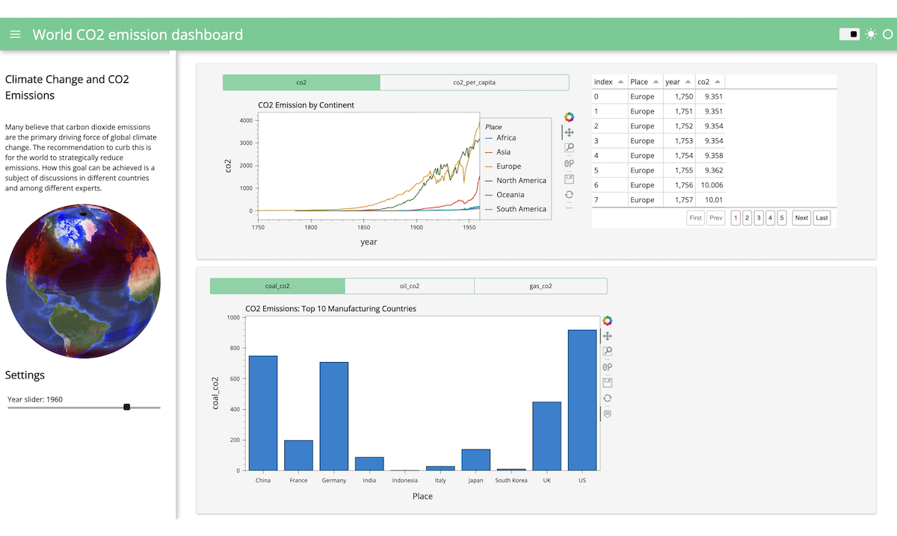

<html>

   
  <h2 style: "text-align: center;">Interactive dashboard with Python</h2>
  <h3 style: "text-align: center;">Using CO2 Emissions and Climate Change data</h3>

</html>

1. [Introduction](#step1)
2. [Installing Packages and Data upload](#step2)
3. [Data Cleansing](#step3)
4. [Continets CO2 emission over time](#step4)
5. [CO2 Emission Table over time](#step5)
6. [CO2 sources of top 10 Manufacturing countries](#step6)
7. [The Interactive Dashboard](#step7)
8. [Conclusion](#step8)

###  1. Introduction
This project creates a dashboard to show the CO2 emissions using Python with with Panel and hvplot. The data is obtained from
<a href="http://ourworldindata.org" target="_blank"> Our World in Data</a>. Reference is made to Statistica for<a href="https://www.statista.com/chart/20858/top-10-countries-by-share-of-global-manufacturing-output/" target="_blank"> Top 10 countries by share of global manufacturing output in 2020</a> .

I found [Panel](https://panel.holoviz.org/index.html), a high-level app and dashboarding framework for Python very interesting and useful. Panel is a fully open source Python library which enables users to create interactive, web-based data dashboards. It connects user widgets to plots, images, tables, and text. It works with IPython notebook files which can leverage the Jupyter server or can be used with a normal web server, using code. I give credit to <a href="https://github.com/sophiamyang" target="_blank"> Sophia Yang</a> for the inspiration. Out of curiosity, I decided to try it out as a personal project to see the effects of CO2 emission in different countries/continents. I filter out the data a little bit more using Pandas and somehow separated the data into two different dataframes:

### <u>Objective</u>: 
##### Create an Interactive dashboard with Panel and Python to display and filter
1. The CO2 reading of six continents: Africa, Asia, Europe, North America, South America and Oceania 
1. Top 10 manufaturing countries by share of global manufacturing output in (2020) (interacting with their CO2 emission)

Ultimately we shall get a deplyable interactive dashboard as a local host exactly as the image shown below in case you decide to use my notebook. Ofcourse exploring the dataset might give anyone a different analysis mindset. Within the actual local host at the end,  we can easily see the interactivity with the slider adjustment in the side panel or by tuggling between the  desired CO2widgets.

  You can check out the entire content in the notebook file , "interactive_dashboard.ipynb"

